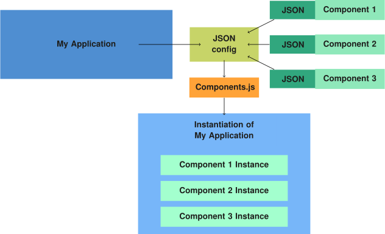

# Introduction

[Components.js] is a [dependency injection] framework for JavaScript applications.

Object-oriented applications are typically composed of hard-wired component.
For example, when programming a _Car_ instance, several _Seat_ components of a specific type can be inserted.
When different seats would be required, the source code would have to be changed.

Instead of hard-wiring software components together, _dependency injection_
allows these components to be defined externally,
without the programmer having to know the exact component during implementation.

Components.js is a dependency injection framework that allows components
to be _instantiated_ and _wired together_ declaratively using _semantic configuration files_.
The advantage of these semantic configuration files is that software components can be uniquely and globally identified using [URIs].
Configurations can be written in JSON.

This software is aimed at developers who want to build _modular_ and _easily configurable_ and _rewireable_ JavaScript applications.
For example, [Comunica](https://github.com/comunica/comunica/) is a meta query engine for the Web that uses Components.js
to wire modules together in a flexible way to achieve easily configurable query engines.

!!! note
    More specifically, configuration files are written in [JSON-LD],
    which is a way to serialize [RDF] in JSON.
    In fact, [different kinds of RDF serialization can be used](./getting_started/basics/config_serializations/), such as Turtle and TriG.

The following image shows an overview of how Components.js works in summary.
Given an application and several external components,
the application can be instantiated and the components can be dynamically injected using a JSON config file.



# Quick Start (TypeScript)

#### 1. Install dependencies

Components.js can be installed using npm:
```bash
$ npm install componentsjs
```

Component and module files can be _automatically_ generated using [Components-Generator.js](https://github.com/LinkedSoftwareDependencies/Components-Generator.js):
```bash
$ npm install -D componentsjs-generator
```

#### 2. Mark your package as a Components.js module

This will allow Components.js to find your module(s) when they are included from other packages.

`package.json`:
```json
{
  "name": "my-package",
  "version": "2.3.4",
  "lsd:module": true
}
```

#### 3. Create a configuration file to instantiate our class

Assuming a TypeScript class that is exported from the package:
```typescript
export class MyClass {
  public readonly name: string;
  constructor(name: string) {
    this.name = name;  
  }
}
```

`config.jsonld`:
```json
{
  "@context": [
    "https://linkedsoftwaredependencies.org/bundles/npm/componentsjs/^4.0.0/components/context.jsonld",
    {
      "ex": "http://example.org/",
      "name": "ex:MyPackage/MyClass#name"
    }
  ],
  "@id": "http://example.org/myInstance",
  "@type": "MyClass",
  "MyClass:_name": "John"
}
```

This configuration is a semantic representation of the instantiation of `MyClass` with `name` set to `"John"`.

#### 4. Instantiate from config file

```javascript
...
import { ComponentsManager } from 'componentsjs';

const manager = await ComponentsManager.build({
  mainModulePath: __dirname, // Path to your npm package's root
});
await manager.configRegistry.register('config.jsonld');
const myInstance = await manager.instantiate('http://example.org/myInstance');
...
```

`myInstance` is an instance of type `MyClass`, as defined in the config file.

# Quick Start (JavaScript)

#### 1. Install dependencies

Components.js can be installed using npm:
```bash
$ npm install componentsjs
```

#### 2. Define your module and its components

Assuming a JavaScript class that is exported from the package:
```typescript
export class MyClass {
  public readonly name;
  constructor(name) {
    this.name = name;  
  }
}
```

`module.jsonld`:
```json
{
  "@context": [
    "https://linkedsoftwaredependencies.org/bundles/npm/componentsjs/^4.0.0/components/context.jsonld",
    { "ex": "http://example.org/" }
  ],
  "@id": "ex:MyPackage",
  "@type": "Module",
  "requireName": "my-package",
  "components": [
    {
      "@id": "ex:MyPackage/MyClass",
      "@type": "Class",
      "requireElement": "MyClass",
      "parameters": [
        { "@id": "ex:MyPackage/MyClass#name", "unique": true }
      ],
      "constructorArguments": [
        { "@id": "ex:MyPackage/MyClass#name" }
      ]
    }
  ]
}
```

The npm module `my-package` exports a class with the name `MyClass`.

The constructor of `MyClass` takes a single `name` argument.

#### 3. Create a configuration file to instantiate our class

`config.jsonld`:
```json
{
  "@context": [
    "https://linkedsoftwaredependencies.org/bundles/npm/componentsjs/^4.0.0/components/context.jsonld",
    {
      "ex": "http://example.org/",
      "name": "ex:MyPackage/MyClass#name"
    }
  ],
  "@id": "http://example.org/myInstance",
  "@type": "ex:MyPackage/MyClass",
  "name": "John"
}
```

This configuration is a semantic representation of the instantiation of `MyClass` with `name` set to `"John"`.

#### 4. Instantiate from config file

```javascript
...
import { ComponentsManager } from 'componentsjs';

const manager = await ComponentsManager.build({
  mainModulePath: __dirname, // Path to your npm package's root
});
await manager.configRegistry.register('config.jsonld');
const myInstance = await manager.instantiate('http://example.org/myInstance');
...
```

`myInstance` is an instance of type `MyClass`, as defined in the config file.

## Learn more

[_Example Source_](https://github.com/LinkedSoftwareDependencies/Examples-Components.js/tree/master/documentation/home/quick_start)

Please refer to the remainder of this documentation for more details on each of these parts.

!!! note
    A full stand-alone version of this [example](https://github.com/LinkedSoftwareDependencies/Examples-Components.js/tree/master/documentation/home/quick_start),
    and all other examples in this documentation be found on a dedicated [GitHub repository](https://github.com/LinkedSoftwareDependencies/Examples-Components.js).

## Source

Contribute to this documentation on [GitHub].

_[This documentation itself is instantiable using Components.js!](./example/)_

[Components.js]: https://github.com/LinkedSoftwareDependencies/Components.js
[GitHub]: https://github.com/LinkedSoftwareDependencies/Documentation-Components.js
[dependency injection]: https://martinfowler.com/articles/injection.html
[Node.js]: https://nodejs.org/en/
[URIs]: https://www.w3.org/wiki/URI
[RDF]: https://www.w3.org/RDF/
[JSON-LD]: https://json-ld.org/
